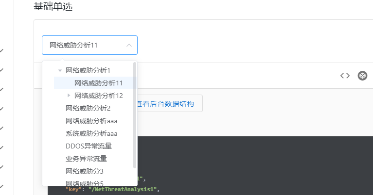
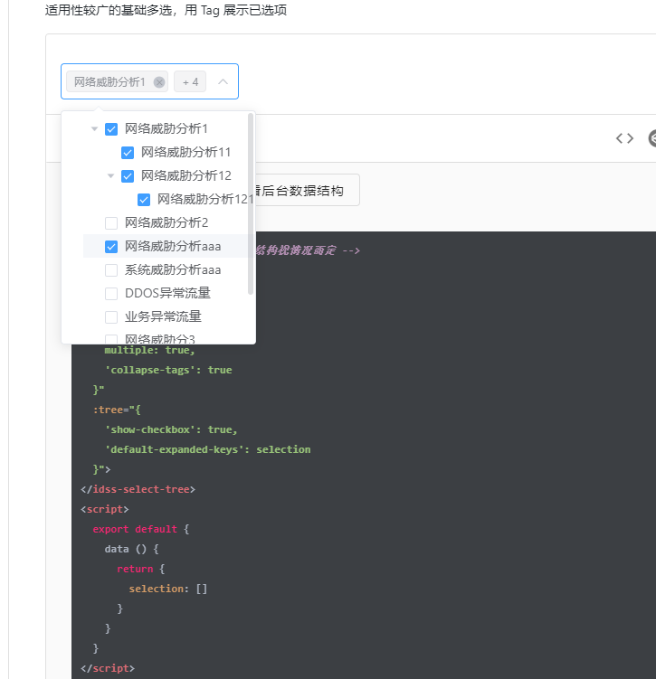
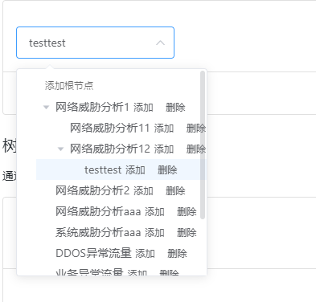
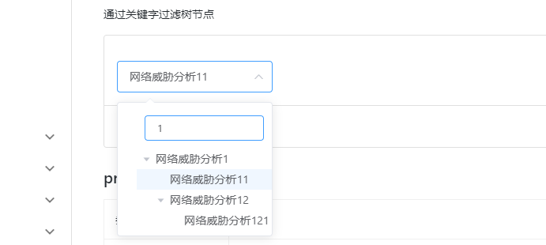

# idss-select-tree 下拉选择树

### 说明

- 此组件是有 el-select 和 el-tree 组件结合而成，由于这两个组件的扩展性都比较强，所以在组件设计中保留了组件本身的所有配置项
- 分别通过属性 select 和 tree 类配置
- 传送门：[el-select 配置项](http://element.eleme.io/#/zh-CN/component/select)，[el-tree 配置项](http://element.eleme.io/#/zh-CN/component/tree)


### 基础单选


```html
<!-- 数据结构仅作为参照，具体结构视情况而定 -->
<idss-select-tree
  :data="originData"
  v-model="selection3"
  :select="{
    clearable: true
  }"
  :tree="{
    'highlight-current': true
  }">
</idss-select-tree>
<script>
  export default {
    data () {
      return {
        selection3: ''
      }
    }
  }
</script>
```
**如下图:**




### 基础多选
>适用性较广的基础多选，用 Tag 展示已选项

```html
<!-- 数据结构仅作为参照，具体结构视情况而定 -->
<idss-select-tree
  :data="originData"
  v-model="selection"
  :select="{
    multiple: true,
    'collapse-tags': true
  }"
  :tree="{
    'show-checkbox': true,
    'default-expanded-keys': selection
  }">
</idss-select-tree>
<script>
  export default {
    data () {
      return {
        selection: []
      }
    }
  }
</script>
```
**如下图:**




### 自定义树节点
> 在 slot 为 node 内添加自定义节点，或者使用 render-content 的方式，示例略


```html
<!-- 数据结构仅作为参照，具体结构视情况而定 -->
<idss-select-tree style="width: 400px;"
  :data="customTree"
  v-model="selection3"
  :select="{
    multiple: false,
    clearable: true
  }"
  :tree="{
    'show-checkbox': false,
    'highlight-current': true
  }">
  <span style="display: inline-block; padding-left: 10px;">
    <el-button type="text" size="mini" @click="() => append('root')">添加根节点</el-button>
  </span>
  <span slot="node" slot-scope="{ node, data }">
    <span>{{ node.label }}</span>
    <span>
      <el-button
        type="text"
        size="mini"
        @click.stop="() => append(data)">
        添加
      </el-button>
      <el-button
        type="text"
        size="mini"
        @click.stop="() => remove(node, data)">
        删除
      </el-button>
    </span>
  </span>
</idss-select-tree>
<script>
  export default {
    data () {
      return {
        selection3: '',
        key: 444
      }
    },
    methods: {
      append(data) {
        let key = this.key++
        const newChild = { key: key + '', label: 'testtest', children: [] };
        if (data === 'root') {
          // 根节点
          this.customTree.push(newChild)
        } else {
          // 普通节点
          if (!data.children) {
            this.$set(data, 'children', [])
          }
          data.children.push(newChild)
        }
      },
      remove(node, data) {
        const parent = node.parent;
        const children = parent.data.children || parent.data;
        const index = children.findIndex(d => d.key === data.key);
        children.splice(index, 1);
      }
    }
  }
</script>
```

**如下图:**



### 树节点过滤
>通过关键字过滤树节点


```html
<!-- 数据结构仅作为参照，具体结构视情况而定 -->
<!-- 获取树的 DOM 元素方法： this.$refs['filterTree'].$refs['tree'] -->
<idss-select-tree style="width: 400px;"
  ref="filterTree"
  :data="customTree"
  v-model="selection3"
  :select="{
    multiple: false,
    clearable: true
  }"
  :tree="{
    'show-checkbox': false,
    'highlight-current': true,
    'filter-node-method': filterNode
  }">
  <div style="padding: 10px;">
    <el-input size="small"
      placeholder="输入关键字进行过滤"
      v-model="filterText">
    </el-input>
  </div>
</idss-select-tree>
<script>
  export default {
    watch: {
      filterText(val) {
        this.$refs['filterTree'].$refs['tree'].filter(val)
      }
    },
    data () {
      return {
        filterText: '',
        selection3: ''
      }
    },
    methods: {
      filterNode (value, data) {
        console.log('filterNode: ', value)
        if (!value) return true
        return data.label.indexOf(value) !== -1
      }
    }
  }
</script>
```
**如下图:**




### props

| 参数 | 说明 | 类型 | 可选值 | 默认值 |
| ------ | ------ | ------ | ------ | ------ |
| value / v-model | 绑定值 | array, string, number | --- | --- |
| data | 树的展示数据 | array | --- | --- |
| placeholder | 默认显示内容 | string | --- | 请选择 |
| props | 配置选项，具体查看 el-tree 配置项 | object | --- | --- |
| node-key | 每个树节点用来作为唯一标识的属性，整棵树应该是唯一的 | string | --- | key |
| select | el-select 相关配置项修改 | object | el-select 配置项 | `{'popper-append-to-body': false}` |
| tree | el-tree 相关配置项修改 | object | el-tree 配置项 | `{'expand-on-click-node': false}` |

### Events
直接绑定即可，参照 el-select/el-tree 官方事件，例： `@node-click="handleNodeClick"`
